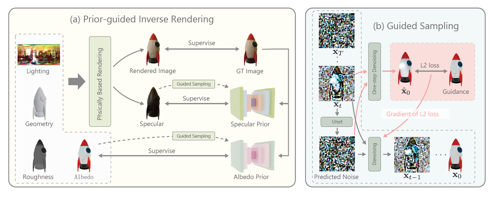

# IntrinsicAnything: Learning Diffusion Priors for Inverse Rendering Under Unknown Illumination

### [Project Page](https://zju3dv.github.io/IntrinsicAnything/) | [Paper](https://arxiv.org/abs/2404.11593) |  [Supplementary](https://drive.google.com/file/d/1vvavfbiiR_Tfqe3QmKFCK1JMAU45qQ6F/view?usp=sharing)

<br/>

> **IntrinsicAnything: Learning Diffusion Priors for Inverse Rendering Under Unknown Illumination** <br>
> [Xi Chen](https://github.com/Burningdust21), [Sida Peng](https://pengsida.net/), [Dongchen Yang](https://dongchen-yang.github.io/), [Yuan Liu](https://liuyuan-pal.github.io/), [Bowen Pan](https://o0helloworld0o-ustc.github.io/), [Chengfei Lv](https://www.mnn.zone/m/0.3/), [Xiaowei Zhou](https://xzhou.me)<br>



## Brewing🍺, code coming soon.

## Results

### Intrinsic Decomposition


### Single view Relighting

https://github.com/zju3dv/IntrinsicAnything/assets/62891073/2e95855c-6d72-4bcb-8c79-577e55e6c926

### Multiview Inverse Rendering
Comming Soon.


## Citation

```bibtex
@article{chen2024intrinsicanything,
    title     = {IntrinsicAnything: Learning Diffusion Priors for Inverse Rendering Under Unknown Illumination},
    author    = {Xi, Chen and Sida, Peng and Dongchen, Yang and Yuan, Liu and Bowen, Pan and Chengfei, Lv and Xiaowei, Zhou.},
    journal   = {arxiv: 2404.11593},
    year      = {2024},
    }
```